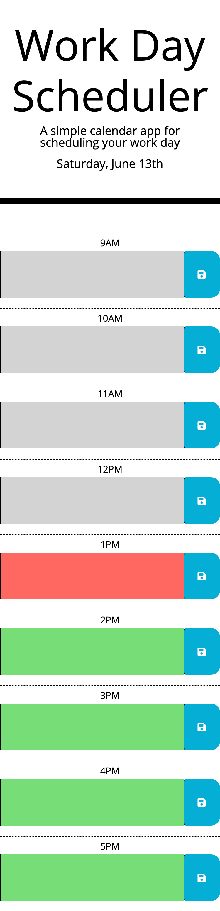
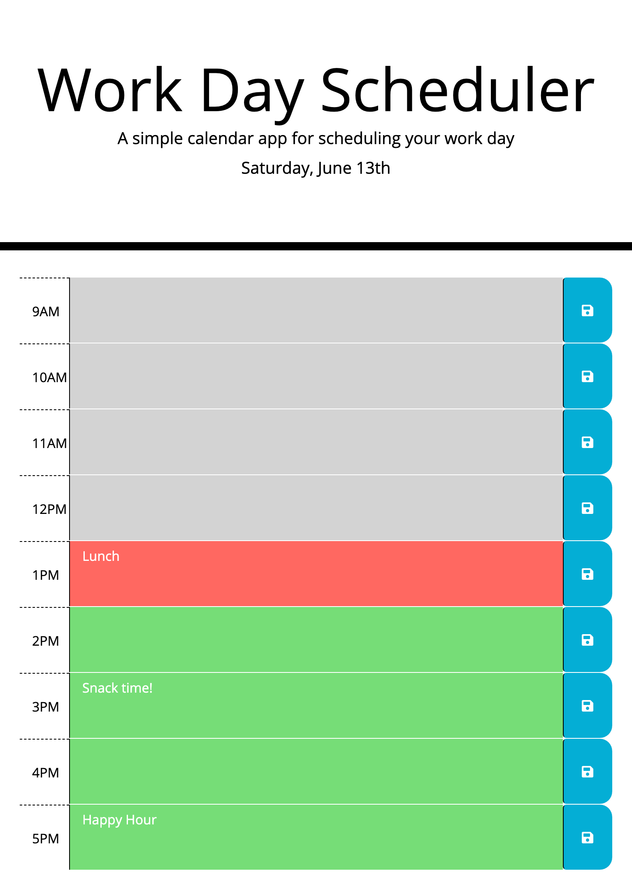

# DayScheduler
* [Deployed Site](https://segh.github.io/DayScheduler)
* [My GitHub](https://github.com/SEGH)

## Description
This is an application with the purpose of allowing a user to schedule events and tasks by hourly time blocks. It runs in the browser and stores the user's input in local storage. Moment.js is used to both visually update the time block colors based on the current time and when saving schedule descriptions. It currently accepts and displays input for standard business hours, but can be customized by changing the name value of a time block's textarea.

## Usage
* When the user opens the scheduler they see the current day's schedule and time blocks with background colors associated with the current hour.
* To schedule an event or task, the user can click in an hour's textarea and type their chosen description.
* If they press the Save icon for that time block, the text description is saved to local storage.
* When the page is refreshed, saved descriptions are displayed in their corresponding time blocks.

## Examples of responsive interface

### 375px

------

### 768px

------

### 980px

------